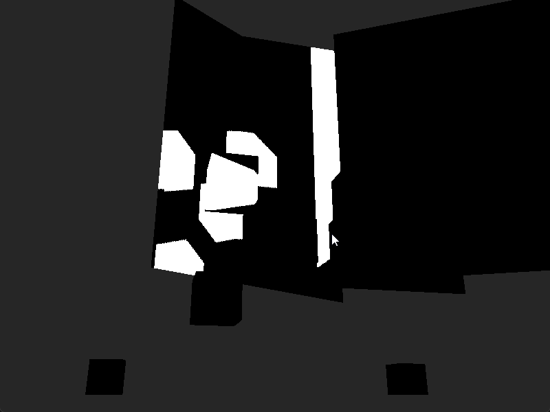
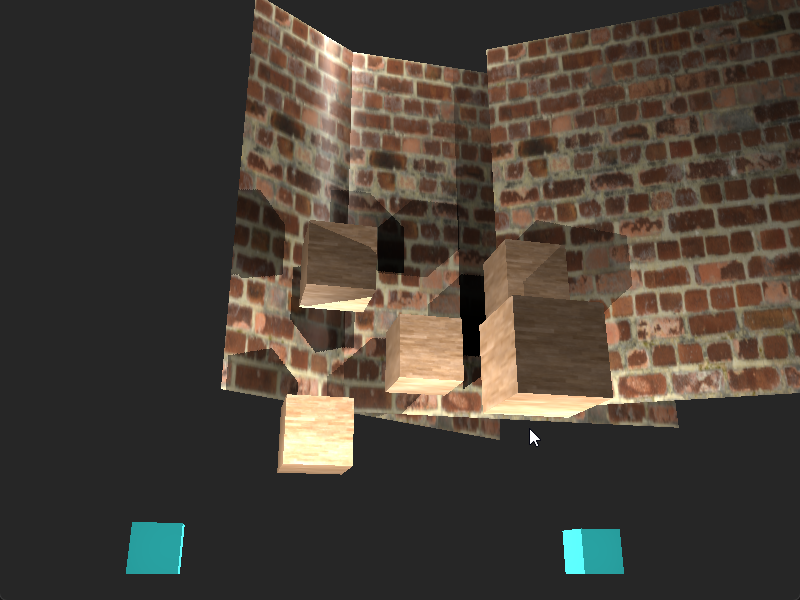

# Game Engine (OpenGL)

A custom 3D game engine written in C++ using OpenGL 4.3.
This project was written for **Podstawy grafiki komputerowej 1**.


| Dynamic Shadows | Multiple Lights |
| :---: | :---: |
|  |  |

## Features

- **Shadow Mapping:** Real-time shadows using depth framebuffers.
- **Camera:** First-person free-look camera (FPS style).
- **Lighting:** Phong lighting model with multiple light sources.

## Tech Stack

- **Language:** C++
- **Build System:** CMake
- **Dependencies:**
  - **GLM:** Mathematics
  - **FreeGLUT:** Window management
  - **GLEW:** OpenGL extension loading
  - **stb_image:** Texture loading

## Controls

| Key            | Action        |
| :------------- | :------------ |
| **W, A, S, D** | Move          |
| **Mouse**      | Look          |
| **Q / E**      | Fly Up / Down |
| **B**          | Spawn Cube    |
| **F**          | Remove Cube   |
| **1 - 4**      | Debug Modes   |

## 🚀 Build & Run

### Prerequisites

- **CMake** 3.11+
- **C++ Compiler** (MSVC recommended)
- **OpenGL 4.3** compatible GPU

This project includes CMake presets for easy configuration with MSVC and Ninja.

```bash
# Configure
cmake --preset x64-release

# Build
cmake --build --preset x64-release

# Run
./out/build/x64-release/Engine-3D.exe
```
